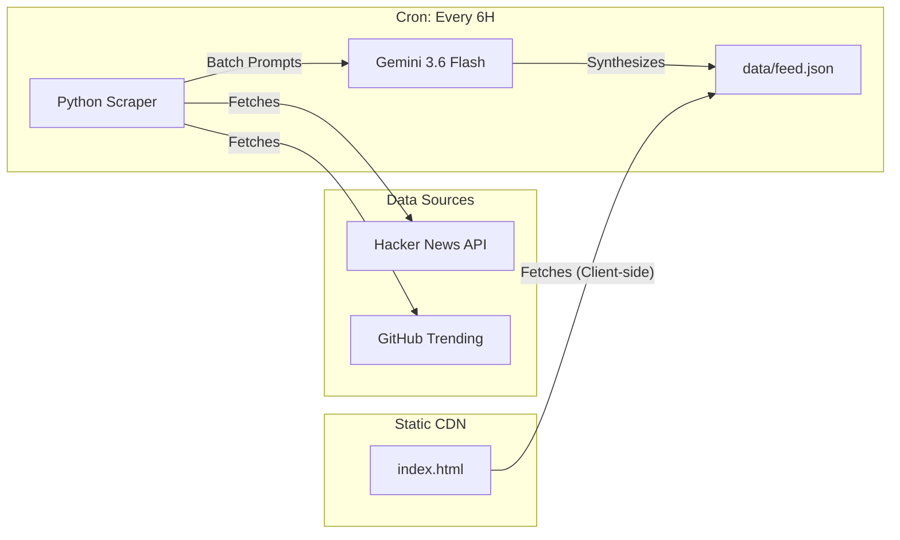

# AI Radar

A fully automated, zero-cost AI news aggregator and curator. 
Fetches the latest AI agent, open-source, and vibe-coding trends, synthesizes them using LLMs, and deploys as a static feed.

## Architecture & Build Pipeline

The project is designed to operate continuously at **$0 infrastructure cost** by leveraging serverless CI/CD and edge static hosting. It completely eliminates traditional database and backend server dependencies.



### 1. Data Ingestion & Synthesis (Backend)
- **Trigger**: A GitHub Actions workflow (`scraper.yml`) runs on a CRON schedule (every 6 hours).
- **Extraction**: A Python script (`src/main.py`) queries APIs and scrapes HTML to gather the latest trends from Hacker News (Hot) and GitHub Trending.
- **Synthesis (LLM Batching)**: Sourced metadata is passed to the Gemini 3.6 Flash API. To completely bypass the strict Free-tier API rate limits (20 requests/day), all fetched articles are batched into a single prompt for one-shot summarization and categorization.
- **Persistence**: The resulting JSON payload is committed directly back to the repository's `data/feed.json` via the CI runner. This git-backed storage acts as a headless CMS.

### 2. Presentation (Frontend)
- **Framework-less**: To ensure instant load times and eliminate build-step bloat, the frontend is a single, pure `index.html` file.
- **Styling**: Tailwind CSS (via CDN) is heavily utilized.
- **Anti-Vibe-Coding UI**: Deliberately avoids generic "Card UIs" or heavy shadows. Employs a minimalist, 4-column Kanban board layout (Open Source, News, Info, Community) inspired by premium developer tools.
- **Typography**: Strictly uses `Pretendard` for Korean legibility, with a heavily constrained grayscale color palette.
- **Deployment**: Hosted natively on GitHub Pages, served directly from the `master` branch.

## Tech Stack

- **Compute**: GitHub Actions (Ubuntu runner)
- **Language**: Python 3.11
- **AI/LLM**: Google Gemini 3.6 Flash (`google-genai`)
- **Frontend**: Vanilla HTML5, JavaScript (ES6+), Tailwind CSS
- **Hosting**: GitHub Pages

## Local Setup

To run the pipeline locally or deploy your own instance:

1. **Clone the repository**
   ```bash
   git clone https://github.com/bin7335/ai-radar.git
   cd ai-radar
   ```

2. **Install dependencies**
   ```bash
   pip install -r src/requirements.txt
   ```

3. **Set environment variables**
   Ensure you have a Gemini API key.
   ```bash
   export GEMINI_API_KEY="your_api_key_here"
   ```

4. **Execute the scraper**
   ```bash
   python src/main.py
   ```
   *This will fetch new items, summarize them, and update `data/feed.json`.*

5. **Serve the frontend**
   Open `index.html` in any web browser, or serve it locally:
   ```bash
   python -m http.server 8000
   ```

## License
MIT

