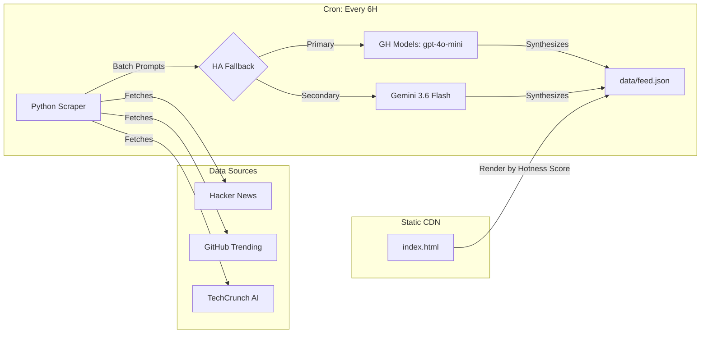

# AI Radar

[](https://bin7335.github.io/ai-radar/)

A fully automated, zero-cost AI news aggregator and curator. 
Fetches the latest AI agent, open-source, and vibe-coding trends, synthesizes them using LLMs, and deploys as a static feed.

## Architecture & Build Pipeline

The project is designed to operate continuously at **$0 infrastructure cost** by leveraging serverless CI/CD and edge static hosting. It completely eliminates traditional database and backend server dependencies.



### 1. Data Ingestion & Synthesis (Backend)
- **Trigger**: A GitHub Actions workflow (`scraper.yml`) runs on a CRON schedule (every 6 hours).
- **Extraction**: Gather the hottest 25 trends from Hacker News, GitHub Trending, and TechCrunch AI RSS.
- **Synthesis (HA LLM Batching)**: Sourced metadata is batched into a single prompt for summarization. The pipeline uses a Highly Available Multi-Model Fallback system: it attempts GitHub Models (`gpt-4o-mini`) first for free, fast inference, and falls back to Google Gemini (`gemini-3.6-flash`) if the primary endpoint fails.
- **Strict Categorization**: The LLM is strictly instructed to differentiate between "Open Source" (tools/repos) and "Info" (money/token saving tips, free promos) to ensure high-quality curation.
- **Persistence**: The resulting JSON payload is committed directly back to the repository's `data/feed.json`.

### 2. Presentation (Frontend)
- **Framework-less**: A single `index.html` file using Tailwind CSS (via CDN).
- **Anti-Vibe-Coding UI**: Minimalist 4-column Kanban board layout (Open Source, News, Info, Community) with independent desktop column scrolling.
- **Hotness Sorting**: Items are dynamically sorted in the client-side JavaScript based on their extracted community points (GitHub Stars, HN Upvotes), displaying a `🔥 [score]` badge.
- **Deployment**: Hosted natively on GitHub Pages.

## Tech Stack

- **Compute**: GitHub Actions
- **Language**: Python 3.11
- **AI/LLM**: GitHub Models (`openai`), Google Gemini (`google-genai`)
- **Frontend**: Vanilla HTML5, JavaScript (ES6+), Tailwind CSS
- **Hosting**: GitHub Pages

## Local Setup

To run the pipeline locally or deploy your own instance:

1. **Clone the repository**
   ```bash
   git clone https://github.com/bin7335/ai-radar.git
   cd ai-radar
   ```

2. **Install dependencies**
   ```bash
   pip install -r src/requirements.txt
   ```

3. **Set environment variables**
   ```bash
   export GH_MODELS_TOKEN="your_github_pat_here"
   export GEMINI_API_KEY="your_gemini_key_here" # Optional fallback
   ```

4. **Execute the scraper**
   ```bash
   python src/main.py
   ```
   *This will fetch new items, summarize them, and update `data/feed.json`.*

5. **Serve the frontend**
   Open `index.html` in any web browser, or serve it locally:
   ```bash
   python -m http.server 8000
   ```

## License
MIT

